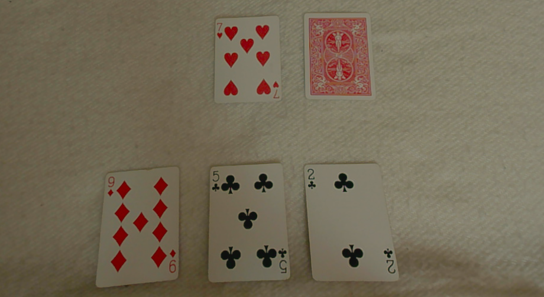
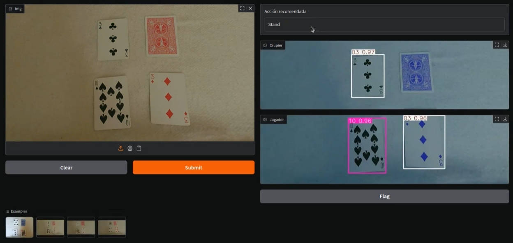

# Datamind

Este repositorio contiene el proyecto final del equipo formado por Alejandro Pérez, Lidia Lago, Hans Muñoz y Ángela García, para el máster de Inteligencia Artificial y Analítica de la escuela Mioti. El objetivo de este proyecto es conseguir un que a partir de una sola imagen del tablero de juego, el modelo sugiera la acción a realizar.

Para llevar esto a cabo necesitaremos dos modelos: uno de reconocimiento de imágenes y otro de decisión de la acción a realizar.

## 1. Modelo de Reconocimiento de Cartas
El modelo y desarrollo de este se encuentra en la carpeta [CardRecognitionModel](CardRecognitionModel). Esta contiene los scripts de entrenamiento y validación, mientras que el modelo en sí se encuentra [aquí](CardRecognitionModel/runs/detect/cards_detector/weights) y es en concreto el llamado **[best.pt](CardRecognitionModel/runs/detect/cards_detector/weights/best.pt)**. Por desgracia, no fuimos capaces de subir los datos de entrenamiento por su gran magnitud, pese a que lo intentamos usando LFS.

## 2. Modelo de Blackjack
Los *notebooks* de preprocesado y creación del modelo se encuentran en la carpeta [BlackjackModel](BlackjackModel) mientras que los datos del modelo, incluyendo el dataset original de Kaggle y los datasets de entrenamiento (y test) y validación se encuentran en la carpeta [BlackjackData](BlackjackData).

El *notebook* de preprocesado llamado **[dataset_cleaning.ipynb](BlackjackModel/dataset_cleaning.ipynb)** contiene descripciones de los pasos llevados a cabo para crear los datasets necesarios. En cuanto a modelos, creamos dos, uno con más datos que el otro pero las diferencias de rendimiento eran despreciables. Estos modelos se encuentran en la carpeta [BlackjackModel](BlackjackModel/Models).

## 3. Resultado final
Finalmente, combinamos los dos modelos en el *notebook* **[combined_model.ipynb](FinalModel/combined_model.ipynb)** y los implementamos mediante una interfaz de Gradio. Esta interfaz tiene un input de tipo *Image* al que se le debe pasar la imagen completa del tablero, preferiblemente con las cartas del crupier en la parte superior y las del jugador en la inferior de la siguiente manera: 

Una vez introducida la imagen, se divide a la mitad automáticamente y se ejecuta el modelo de Detección de Cartas para la parte superior y para la parte inferior. Las cartas detectadas serán las que se introduzcan al modelo de Blackjack y puesto que al estudiar el modelo descubrimos que hay ciertas variables, como el número de cartas restantes, el *run_count* o el *true_count* no tienen apenas impacto en la decisión de la acción, nos centramos en las variables que cuentan, el valor total de las cartas del jugador y la carta del crupier. Creamos un dataset con esta información y lo introducimos al modelo para obtener la acción recomendada.

La interfaz final queda así:

Y se puede ver en video [aquí](Demo_jugadorBlackjack.mp4)

<video height="400" controls>
  <source src="Demo_jugadorBlackjack.mp4" type="video/mp4">
</video>